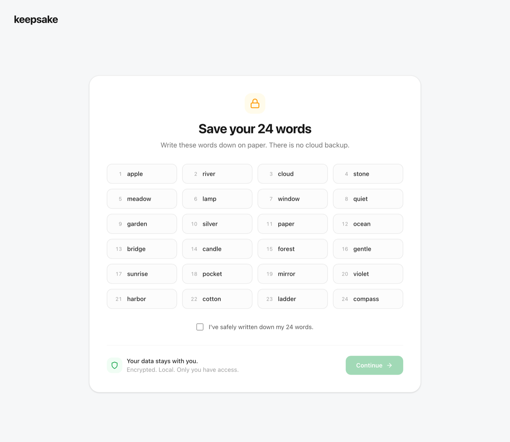
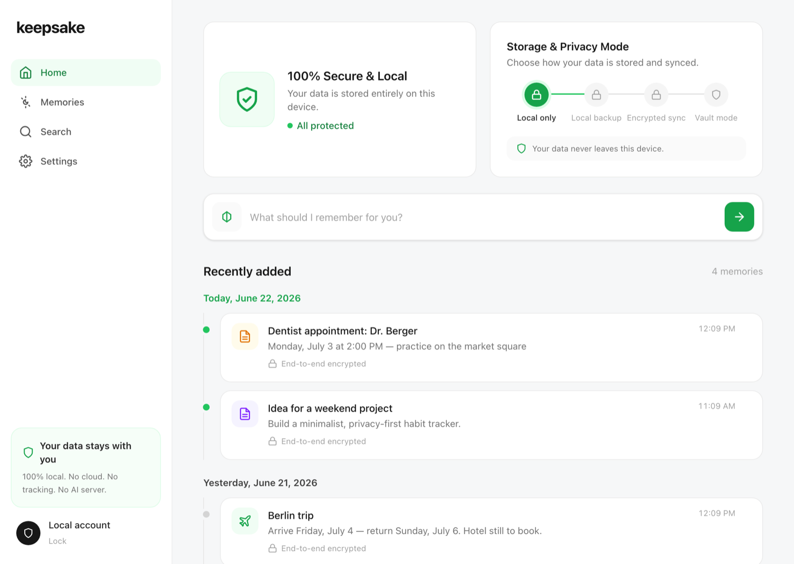
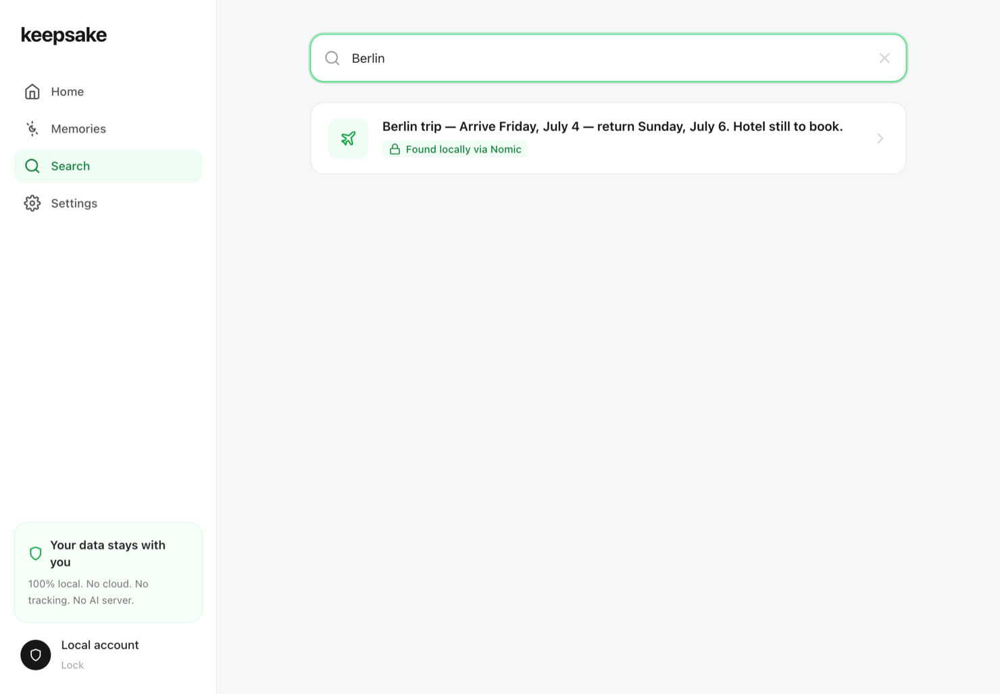

<div align="center">

# Keepsake

### A sovereign, local-first, zero-knowledge long-term memory for LLMs and AI agents.

**You own your memory like a crypto wallet — a 24-word seed, encrypted on your device, usable in front of any model.**

`Apache-2.0` · no accounts · no telemetry · local-first · optional zero-knowledge sync · post-quantum

[**Download**](https://github.com/keepsake-hq/keepsake/releases) · [**@keepsake_hq**](https://x.com/keepsake_hq)

</div>

---

> ## The honest truth (read this first)
>
> Zero-knowledge **at rest** is achievable. Zero-knowledge **during cloud inference** is not — anything you send to a cloud model is plaintext to that provider. Keepsake does not pretend otherwise. It makes the local path the default and makes any cloud disclosure **explicit, minimized, and audited** rather than hiding it.
>
> | Mode | Storage secret | Secret from the model provider |
> |---|---|---|
> | **Local model** (Ollama / MLX) | ✅ | ✅ nothing leaves the device |
> | **Cloud model** | ✅ | ❌ injected context is plaintext to the provider |
>
> This honesty is the point. If a memory tool tells you cloud inference is "zero-knowledge," it is lying to you.

> **Young & unaudited.** Keepsake is v0.x, built in the open and **not yet externally audited**. See [SECURITY.md](SECURITY.md) for the honest threat model (including exactly how the seed is handled and how the shared daemon reduces that exposure) and how to report a vulnerability.

## What it is

Most "AI memory" lives on someone else's servers, tied to one vendor, readable by them, gone if they shut down. Keepsake flips that: your memory is a **single encrypted file on your machine**, unlocked by a **BIP-39 seed phrase** you alone hold. Point any OpenAI-compatible client at the local proxy, or connect an MCP-capable agent, and the model gains a long-term memory that **never leaves your device** unless you explicitly send it.

- 🔐 **Yours like a wallet.** A 24-word seed derives every key. No account, no server, no recovery-by-vendor.
- 🧠 **Real semantic memory, fully local.** On-device embeddings (Nomic) + an in-RAM vector index. Ask "when do I fly to Berlin?" and it recalls "Berlin trip — arrive Friday" without a single exact-word match.
- 🧨 **Cryptographic erasure that's actually final.** `forget` destroys a memory's key, not just a row — the ciphertext becomes mathematically undecryptable.
- 🛰️ **Use it with any model.** A local OpenAI-compatible gateway (swap your `base_url`) and an MCP server for Claude / Cursor / Codex.
- 🔗 **One hub, every agent.** Run the shared hub (`keepsake serve`, or just open the desktop app) and Claude, Cursor, Codex and the proxy all read/write the **same live memory** — each authenticating with a scoped capability token, never the seed. Reachable over the network (token-required) for remote/cloud agents. One-command setup: `keepsake mcp-config`.
- 🔄 **Same memory on all your devices — privately.** Optional encrypted sync through a **blind relay** (host your own, or point at a shared one): it stores only ciphertext keyed to an *unguessable, write-token-protected* per-vault slot, so your devices converge on one memory and nobody — not even whoever runs the relay — can read it. Local-first stays the default; sync is opt-in.
- 🧩 **Automatic, deduped memory.** Turns through the gateway are captured automatically; a write-time similarity guard plus a background consolidation sweep keep the store from filling with duplicates.
- 🧠 **Quality recall, not just similarity.** Recency-weighted ranking, superseded facts hidden via a bi-temporal ledger, per-memory provenance, and a **knowledge graph** (entities + relations) that surfaces connected memories a pure vector search misses.
- 🔺 **A distilled profile, injected first.** Optionally, the model you're already talking to keeps a compact **profile** of you (a hierarchical-memory pyramid: raw memories → a high-level overview). It's injected *before* specific recalls, so the model reads the big picture first and drills into details only as needed — fewer tokens, better grounding. The profile is derived, stays local, and is cleared the moment you `forget` anything (erasure stays honest).
- ☁️ **Cloud models, on your terms.** Route a turn to an OpenAI-compatible cloud provider under the Privacy Dial — PII redacted and a signed receipt written before anything leaves; your API keys stay in your env. Local stays the default.
- 🔒 **Zero-knowledge backup (core).** Optional OPAQUE-authenticated backup: a self-hosted server validates your password and stores an encrypted blob without ever seeing the password, seed, or plaintext.
- 🔭 **Post-quantum ready.** Sharing and signatures use ML-DSA-65 and an X25519 + ML-KEM-768 hybrid.
- 🎛️ **A Privacy Dial, not a hidden switch.** Per-request: local-only · redacted-cloud · full-cloud · no-memory — every cloud disclosure writes a signed, local Memory Receipt.

Keepsake is **SAIHM Cell-/Tool-compatible** (local receipt profile) — interoperable with the [Sovereign AI Horizontal Memory](https://saihm.coti.global) protocol's cell format and tool surface, while staying chain-free (no token, no on-chain anything).

## Screenshots

The desktop app is a calm, light, Apple/Notion-style space — not another neon dashboard.

| Onboarding | Home | Search |
|---|---|---|
|  |  |  |

## Install (macOS, Apple Silicon)

Grab `Keepsake_x.y.z_aarch64.dmg` from the [latest release](https://github.com/keepsake-hq/keepsake/releases), open it, and drag Keepsake to Applications.

**First launch — the unsigned-app step.** Keepsake is intentionally **not** notarized by Apple. Notarizing requires a paid Apple Developer account that ties the app to a legal identity, and this project ships anonymously on purpose. So the binary is **ad-hoc signed**, and macOS Gatekeeper will refuse the first double-click. To run it:

1. **Right-click** (or Control-click) the Keepsake app → **Open**.
2. In the dialog, click **Open** again.

…or: **System Settings → Privacy & Security → "Open Anyway"**. You only do this once. (Prefer zero trust in our binary? [Build it yourself](#build-it-yourself) — it's the same result.)

> First unlock downloads the local embedding model once (~500 MB) into `~/.keepsake/models`; after that the app runs **fully offline**, forever. Nothing about this download identifies you.

## Quickstart (CLI + any local model)

With the [Rust toolchain](https://rustup.rs) and [Ollama](https://ollama.com) (`ollama pull llama3.2:1b`):

```sh
cargo build --release

# 1. Mint a seed — write it down offline; it is the only key to your vault.
./target/release/keepsake init
export KEEPSAKE_MNEMONIC="<the 24 words>"
export KEEPSAKE_DB="$HOME/.keepsake/vault.db"

# 2. Remember & recall, locally.
./target/release/keepsake remember "my launch date is March 14"
./target/release/keepsake recall "when do we launch"   # semantic → decrypt
./target/release/keepsake forget <cell-id>             # cryptographic erasure

# 3. Run the proxy and point any OpenAI client at it.
KEEPSAKE_TOKEN=$(openssl rand -hex 32) \
KEEPSAKE_MNEMONIC="<the 24 words>" \
KEEPSAKE_DB="$HOME/.keepsake/vault.db" \
  ./target/release/keepsake-proxy        # → http://127.0.0.1:8787
```

Point any OpenAI-compatible client at `http://127.0.0.1:8787/v1` with the bearer token. The proxy injects relevant memories, forwards to your local model, and writes the turn back. Per-request posture via the `X-Keepsake-Privacy` header (`local-only` (default) / `redacted-cloud` / `full-cloud` / `no-memory`).

**Cloud models (optional).** Configure providers via env — e.g. `KEEPSAKE_PROVIDER_OPENAI_URL=https://api.openai.com` + `KEEPSAKE_PROVIDER_OPENAI_KEY=…` (keys stay in your env, never logged or written to receipts) — then pick one per request with `X-Keepsake-Provider: openai`. A cloud turn leaves the device only if the Privacy Dial allows it, with PII redacted (in `redacted-cloud`) and a signed receipt written first. Set `KEEPSAKE_AUTO_GRAPH=1` to also distil knowledge-graph triples from each turn (via your **local** model — no cloud egress for building memory). Set `KEEPSAKE_AUTO_PROFILE=1` to keep a compact, model-written **profile** of you, re-distilled in the background and injected first on every recall; it reuses the in-loop model (cloud only if this turn's egress was already permitted) and writes a `profile_distilled` receipt.

## Build it yourself

No trust required. The whole thing builds from source on a Mac with Rust + Node:

```sh
# Desktop app (.app + .dmg, ad-hoc signed)
cd apps/desktop/ui && pnpm install && pnpm exec @tailwindcss/cli -i ./src/input.css -o ./output.css --minify && cd -
cargo install tauri-cli --version "^2" --locked
cd apps/desktop/src-tauri && cargo tauri build --bundles app dmg
# → target/release/bundle/dmg/Keepsake_x.y.z_aarch64.dmg
```

Run the test suite (TDD throughout): `cargo test` · lint: `cargo clippy --all-targets -- -D warnings`.

## Architecture

A Rust workspace. The security-critical core is one small, auditable set of crates; the desktop app is a thin shell over it.

| Crate | Responsibility |
|---|---|
| `keepsake-crypto` | BIP-39 → HKDF roots; **random-DEK AES-256-GCM envelope** (real erasure); **X25519 + ML-KEM-768 hybrid** sharing; **ML-DSA-65** (FIPS-204) signatures; Shamir social recovery; device pairing. |
| `keepsake-core` | Two-plane store (append-only content vs. **erasable** key-manifest); bi-temporal Contradiction Ledger. |
| `keepsake-store-sqlite` | Durable store on **SQLCipher** (full-DB encryption at rest); `forget` = key-row delete + `secure_delete` + WAL truncation. |
| `keepsake-retrieval` | Local embeddings (**Nomic** via `fastembed`/ONNX) + in-RAM vector index + per-cell encrypted embeddings. |
| `keepsake-vault` | Integration: semantic remember / recall / forget / share / SAIHM contracts; **recency-weighted recall**, **ledger-backed supersession**, per-memory **provenance**, **knowledge-graph** enrichment, portable **Passport** export/import. |
| `keepsake-firewall` | Context-Firewall: Privacy Dial, PII redaction, HMAC-chained Memory Receipts, **capability tokens**. |
| `keepsake-proxy` | OpenAI-compatible gateway (axum) → a local model **or a selected cloud provider** under the Privacy Dial; RAG injection + write-back; graph-enriched recall; optional fact/triple auto-extraction; localhost-only security. |
| `keepsake-mcp` | SAIHM tool router + MCP stdio server (Claude / Cursor) with capability-token enforcement; connects to the hub or opens a local vault. |
| `keepsake-daemon` | The shared **hub**: one unlocked vault + live index served to every client over a Unix socket (and optional TCP for remote agents) with capability-token auth; write-time dedup + background consolidation. |
| `keepsake-graph` | Knowledge graph: `(subject, relation, object)` triples distilled from memories, **erasure-aware edges** (forget cascades), graph-enriched recall. |
| `keepsake-backup` | **OPAQUE** zero-knowledge cloud-backup core: a server validates your password & stores an encrypted backup without ever seeing the password, seed, or plaintext (Ristretto255 + Triple-DH + Argon2). |
| `keepsake-sync` + `keepsake-relay` | State-based, erasure-safe snapshot sync over a dumb, **file-backed (SQLite)**, zero-knowledge HTTP relay. **Multi-tenant**: one relay serves many users — each owns an unguessable, write-token-protected slot (trust-on-first-use) — self-hosted or hosted; it only ever sees ciphertext. |
| `keepsake-desktop-core` + `apps/desktop` | **Tauri v2** desktop app — testable command core + a local, offline, Tailwind-v4 frontend. |

### How the crypto holds up

- **Erasure is real, not cosmetic.** Every cell gets a fresh **random** data-encryption key (DEK), wrapped per-holder. `forget` deletes the wrapping; since the DEK was never derived from the seed, the ciphertext is unrecoverable even from a seed + an old content backup. The two-plane store keeps key material **out of** any append-only / synced history.
- **At rest:** the entire database is SQLCipher-encrypted; on disk there isn't even a plaintext SQLite header.
- **Sharing & identity are post-quantum.** Cells are sealed to a recipient with an **X25519 + ML-KEM-768** hybrid; operations are signed with **ML-DSA-65**.
- **Scoped third-party access via capability tokens.** Macaroon-style, attenuable (narrow-only), offline-verifiable — enforced in both the MCP router and the proxy, so an agent can be handed read-only, record-limited access without your seed.
- **The desktop webview is sandboxed offline.** Strict CSP (`default-src 'self'`), no remote origins, no web fonts, Tailwind compiled locally — there is no path for the UI to phone home.

## Why this is anonymous

This project ships without a name attached, on purpose. That is not a reason to trust it less — it's a reason to trust the **code** instead of a person:

- **Apache-2.0**, all of it. Read it, fork it, build it.
- **No telemetry, no accounts, no network by default.** Run the desktop app with Wi-Fi off and watch it work.
- **Small, readable Rust.** The security-critical surface is a handful of crates, not a monolith.
- **Reproduce the binary yourself.** The `.dmg` you download is what `cargo tauri build` produces from this source.

Don't trust us. Verify the source.

## Status & roadmap

Working and test-covered today: the full local path (SQLCipher vault, cryptographic erasure, real semantic memory), the OpenAI-compatible proxy (verified against Ollama), the MCP server, Privacy Dial + Memory Receipts, post-quantum sharing & signatures, Shamir recovery + device pairing, file-backed relay sync, and the offline desktop app.

Planned: Apple Developer ID signing + notarization (if/when anonymity allows), Automerge field-level CRDT merge, full SLIP-39 word mnemonics + WebAuthn-PRF unlock, mobile (uniffi), and an external security audit. See [`ROADMAP.md`](ROADMAP.md).

## License

[Apache-2.0](LICENSE). There is no token and never will be.
